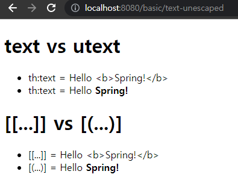

---

# Thymeleaf Basic

김영한 님의 "스프링 MVC 2편 - 백엔드 웹 개발 활용 기술" 강의 코드를 따라치면서 간략하게나마 학습정리를 조금씩 하기 위한 Repository

---

### 프로젝트 환경

- jdk : 11
- IDE : intelliJ Ultimate
- 빌드 : gradle, Spring Boot
```groovy
dependencies {
	implementation 'org.springframework.boot:spring-boot-starter-thymeleaf'
	implementation 'org.springframework.boot:spring-boot-starter-web'
	compileOnly 'org.projectlombok:lombok'
	annotationProcessor 'org.projectlombok:lombok'
	testImplementation 'org.springframework.boot:spring-boot-starter-test'
}
```
- 의존 라이브러리
    - lombok
    - spring-boot-starter-web
    - spring-boot-starter-thymeleaf

---

### welcome 페이지
`resources/static/index.html` : 강의 실습 코드들 실행 결과 `view`를 한 페이지에 모아둠

---

## 타임리프 선언
```html
<html xmlns:th="http://www.thymeleaf.org">
```
- html 선언시 속성으로 xmlns... 을 작성해야함.

---

## 텍스트 출력 - th:text, th:utext
```html
<h1>text vs utext</h1>
<ul>
    <li>th:text = <span th:text="${data}"></span></li>
    <li>th:text = <span th:utext="${data}"></span></li>
</ul>

<h1><span th:inline="none">[[...]] vs [(...)]</span></h1>

<ul>
    <li><span th:inline="none">[[...]] = </span>[[${data}]]</li>
    <li><span th:inline="none">[(...)] = </span>[(${data})]</li>
</ul>
```


1. 태그의 속성으로 지정하여 사용
   - `th:text` : escape 함
   - `th:utext` : escape 안 함(unescaped text)

2. 콘텐츠 영역 안에서 직접 사용
   - `[[...]]` : escape 함
   - `[(...)]` : escape 안 함(unescaped text)

3. escape?
   - HTML 엔티티 : `<`,`>`와 같은 HTML 문법에 적용되는 문자를 문자 그대로 표현하기 위한 문자.
     - 예) `<` -> `&lt;`, `>` -> `&gt;`
   - Escape : 문자열에 포함된 HTML에서 사용되는 문자를 HTML 엔티티로 변경하여 문자 그대로 표현하게 하는 것.


#### (cf) th:inline="none"
- 현재 태그 안의 내용에 대하여 타임리프 문법을 적용하지 말라는 옵션

---

## 변수 - SpringEL 표현식

- 변수 표현식 :`${...}`

### 객체의 프로퍼티 접근
```html
<h1>SpringEL 표현식</h1>
<ul>Object
    <li>${user.username} = <span th:text="${user.username}"></span></li>
    <li>${user['username']} = <span th:text="${user['username']}"></span></li>
    <li>${user.getUsername()} = <span th:text="${user.getUsername()}"></span></li>
</ul>
<ul>List
    <li>${users[0].username} = <span th:text="${users[0].username}"></span></li>
    <li>${users[0]['username']} = <span th:text="${users[0]['username']}"></span></li>
    <li>${users[0].getUsername()} = <span th:text="${users[0].getUsername()}"></span></li>
</ul>
<ul>Map
    <li>${userMap['userA'].username} = <span th:text="${userMap['userA'].username}"></span></li>
    <li>${userMap['userA']['username']} = <span th:text="${userMap['userA']['username']}"></span></li>
    <li>${userMap['userA'].getUsername()} = <span th:text="${userMap['userA'].getUsername()}"></span></li>
</ul>
```
1. 객체 
   - `user` : user 객체
   - `user.username` : user의 username 속성에 접근 (`getUsername()` 사용)
   - `user['username']` : 위와 같은 표현식
   - `user.getUsername()` : user의 `getUsername()` 메서드를 직접 호출

2. List
   - `users[0]` : 리스트의 0번 인덱스에 위치한 객체
   - `users[0].username` : 리스트의 0번 인덱스에 위치한 객체의 username 프로퍼티 접근 (`users[0].getUsername()` 사용)
   - `users[0]['username']` : 위와 같음
   - `users[0].getUsername()` : 리스트에서 첫번째 값을 찾고 메서드 직접 호출
   
3. Map
   - `userMap['userA']` : 맵의 'userA' 키에 맵핑된 객체
   - `userMap['userA'].username` : 맵의 'userA' 키에  맵핑된 객체의 username 프로퍼티 접근 (`userMap['userA'].getUsername()` 사용)
   - `userMAp['userA']['username']` : 위와 같음
   - `userMap['userA'].getUsername()` : 맵의 'userA' 키에  맵핑된 객체를 찾고 메서드 직접 호출

### 지역변수 선언
```html
<h1> 지역변수 - (th:with) </h1>
<div th:with="first=${users[0]}">
    <p>처음 사람의 이름은 <span th:text="${first.username}"></span></p>
</div>
```
- `th:with`를 사용하면 그 태그 영역에서 지역변수를 선언해서 사용할 수 있음.
- 단, 지역변수는 선언된 태그 안에서만 사용 가능

---

## 타임리프에서 기본적으로 제공하는 객체들

### 기본 객체
```html
<h1>식 기본 객체 (Expression Basic Objects)</h1>
<ul>
    <li>request = <span th:text="${#request}"></span></li>
    <li>response = <span th:text="${#response}"></span></li>
    <li>session = <span th:text="${#session}"></span></li>
    <li>servletContext = <span th:text="${#servletContext}"></span></li>
    <li>locale = <span th:text="${#locale}"></span></li>
```
- 요청 : `${#request}` (`HttpServletRequest` 객체가 그대로 제공)
- 응답 : `${#response}` (`HttpServletResponse` 객체가 그대로 제공)
- 세션 : `${#session}` (`HttpSession` 객체가 그대로 제공)
- ServletContext : `${#servletContext}`
- 지역 : `${#locale}`

### 편의 객체
```html
<h1>편의 객체</h1>
<ul>
    <li>Request Parameter = <span th:text="${param.paramData}"></span></li>
    <li>session = <span th:text="${session.sessionData}"></span></li>
    <li>spring bean = <span th:text="${@helloBean.hello('Spring!')}"></span></li>
</ul>
```
- 요청 파라미터 접근
  - 예) 파라미터가 param이고 값이 paramData일때 : `${param.paramData}`
- Http 세션 접근
  - 예) session에 sessionData로 맵핑한 값이 있을 때 : `${session.sessionData}`
- 스프링 빈 접근
  - 예) 빈으로 helloBean으로 등록한 빈이 있을 때 : `${@helloBean.hello('spring!')}`

---

## 유틸리티 객체와 날짜

### 타임리프 유틸리티 객체들
- `#message` : 메시지, 국제화 처리
- `#uris` : URI escape 지원
- `#dates` : `java.util.Date`(Deprecated) 서식 지원
- `#calendars` : `java.util.Calendar` 서식 지원
- `#temporals` : `java.time.*` 서식 지원
- `#numbers` : 숫자 서식 지원
- `#strings` : 문자 관련 편의 기능
- `#objects` : 객체 관련 기능
- `#bools` : boolean 관련 기능
- `#arrays` : 배열 관련 기능
- `#lists`, `#sets`, `#maps` : 컬렉션 관련 기능
- `#ids` :  아이디 처리 관련 기능

### 날짜, 시간
```html
<h1>LocalDateTime</h1>
<ul>
    <li>${localDateTime} (디폴트) = <span th:text="${localDateTime}"></span></li>
    <li>${#temporals.format(localDateTime,'yyyy-MM-dd HH:mm:ss')} = <span th:text="${#temporals.format(localDateTime,'yyyy-MM-dd HH:mm:ss')}"></span></li>
</ul>
<h1>LocalDateTime - Utils</h1>
<ul>
    <li>${#temporals.day(localDateTime)} = <span th:text="${#temporals.day(localDateTime)}"></span></li>
    <li>${#temporals.month(localDateTime)} = <span th:text="${#temporals.month(localDateTime)}"></span></li>
    <li>${#temporals.monthName(localDateTime)} = <span th:text="${#temporals.monthName(localDateTime)}"></span></li>
    <li>${#temporals.monthNameShort(localDateTime)} = <span th:text="${#temporals.monthNameShort(localDateTime)}"></span></li>
    <li>${#temporals.year(localDateTime)} = <span th:text="${#temporals.year(localDateTime)}"></span></li>
    <li>${#temporals.dayOfWeek(localDateTime)} = <span th:text="${#temporals.dayOfWeek(localDateTime)}"></span></li>
    <li>${#temporals.dayOfWeekName(localDateTime)} = <span th:text="${#temporals.dayOfWeekName(localDateTime)}"></span></li>
    <li>${#temporals.dayOfWeekNameShort(localDateTime)} = <span th:text="${#temporals.dayOfWeekNameShort(localDateTime)}"></span></li>
    <li>${#temporals.hour(localDateTime)} = <span th:text="${#temporals.hour(localDateTime)}"></span></li>
    <li>${#temporals.minute(localDateTime)} = <span th:text="${#temporals.minute(localDateTime)}"></span></li>
    <li>${#temporals.second(localDateTime)} = <span th:text="${#temporals.second(localDateTime)}"></span></li>
    <li>${#temporals.nanosecond(localDateTime)} = <span th:text="${#temporals.nanosecond(localDateTime)}"></span></li>
</ul>
```
- `#temporals` : java8 이후 추가된 `LocalDate`, `localTime`, `LocalDateTime`, `Instant` 지원
  - 추가 라이브러리 `thymeleaf-extras-java8time`이 필요한데, 스프링 부트가 알아서 자동으로 추가, 통합해줌

---

## URL

- 문법 : `@{...}`
- a 태그에서 : `<a th:href="@{...}"></a>`

### URL 변수 맵핑
1. 단순 URL
   - `@{/hello}` -> `/hello`

2. 변수 맵핑
   - URL 표현식 안에서 변수를 사용할 경우 앞에서 `{...}`을 통해 경로 변수를 선언
   - 뒤의 ()에서 변수에 맵핑될 값을 선언한다.
   - 앞에서 선언되지 않은 변수를 () 안에서 선언할 경우 쿼리 파라미터로 맵핑된다.

### URL 변수 맵핑 - 예시
```html
<li><a th:href="@{/hello}">basic url</a></li>
```
- 변수가 선언되지 않았으므로 단순 URL이 렌더링된다.
```html
<li><a th:href="@{/hello(param1=${param1}, param2=${param2})}">hello query param!</a></li>
```
- () 앞에서 param1, param2가 선언된 바 없다.
- param1, param2는 앞에서 선언되지 않았으므로 쿼리 파라미터로 맵핑된다.
```html
<li><a th:href="@{/hello/{param1}/{param2}(param1=${param1},param2=${param2})}">path variable</a></li>
```
- () 앞에서 param1, param2가 선언되었다.
- param1, param2는 경로변수로 선언되었으므로 그대로 맵핑된다.
```html
<li><a th:href="@{/hello/{param1}(param1=${param1}, param2=${param2})}">path variable + query parameter</a></li>
```
- () 앞에 param1만 선언되고 param2는 선언되지 않았다.
- param1은 앞에서 경로변수로 선언됐으므로 그대로 맵핑된다.
- param2는 앞에서 경로변수로 선언되지 않았으므로 쿼리파라미터로 취급된다.

---

## 리터럴

- 소스 코드 상에서 고정된 값
- 문자 : 'hello', ...
- 숫자 : 10, ...
- bool : true, false, ...
- null : null

### 문자 리터럴 취급
```html
<h1>리터럴</h1>
<ul>
    <!-- 주의! 띄어쓰기로 된 리터럴을 아래 주석과 같이 그대로 "" 사이에 풀어쓰면 예외가 발생함 !-->
    <!--    <li>"hello world!" = <span th:text="hello world!"></span></li>-->

    <li>'hello' + 'world!' = <span th:text="'hello' + ' world!'"></span></li>
    <li>'hello world!' = <span th:text="'hello world!'"></span></li>
    <li>'hello ' + ${data} = <span th:text="'hello' + ${data}"></span></li>
    <li>리터럴 대체 |hello ${data}| = <span th:text="|hello ${data}|"></span></li>
</ul>
```
1. 원칙적으로 문자 리터럴은 작은 따옴표(`'`)으로 감싸야하며, 결합은 + 을 통해 결합해야한다.
   - 예) th:text="'hello'"

2. 공백 없이 쭉 이어질 경우 작은 따옴표(`'`)를 생략할 수 있다.
   - 허용 : `A-Z`, `a-z`, `0-9`, `[]`, `.` `-`, `_`
     - 예) th:text="hello"
   - 예외 : 공백이 있는 상태로 풀어 사용할 경우 예외가 발생한다!!!
     - 예) th:text="hello world!"

3. 리터럴 대체 : 바(`|`)로 감싸면 리터럴로 대체된다.
   - 예) th:text="|hello world!|"
   - 예) th:text="|hello ${world}|"

---

## 연산
대체적으로 java의 연산과 비슷하게 작동한다.
1. 산술연산 : `+`, `-`, `*`, `/`, `%`

2. 비교연산 : `<`. `>`는 가급적 HTML 엔티티를 사용하는 것이 좋다.
   - `>` (gt)
   - `<` (lt)
   - `>=` (ge)
   - `<=` (le)
   - `!`(not)
   - `==` (eq)
   - `!=` (neq, ne)

3. 삼항연산자
    ```html
    <li>(10 % 2 == 0)? '짝수':'홀수' = <span th:text="(10 % 2 == 0 )? '짝수':'홀수'"></span></li>
    ```
   - 조건에 부합하면 왼쪽의 값을, 부합하지 않으면 오른쪽 값을 렌더링함

4. Elvis 연산자 (삼항연산자의 편의 버전)
   ```html
   <li>${data}?: '데이터가 없습니다' = <span th:text="${data}?: '데이터가 없습니다.'"></span></li>
   <li>${nullData}?: '데이터가 없습니다' = <span th:text="${nullData}?: '데이터가 없습니다.'"></span></li>
   ```
   - 값이 존재하면 값을 출력, 존재하지 않으면 `:` 뒤의 내용을 출력


5. No-Operation
   ```html
   <li>${data}?: _ = <span th:text="${data}?: _">데이터가 없습니다.</span></li>
   <li>${nullData}?: _ = <span th:text="${nullData}?: _">데이터가 없습니다.</span></li>
   ```
   - 값이 존재하면 값을 출력하고, 존재하지 않을 경우 `_`에 의해, 타임리프 연산이 무시되어 태그로 감싸진 본문의 내용이 그대로 출력됨.

---

## 속성 값 설정

### 속성 덮어쓰기
```html
<input type="text" name="mock" th:name="userA" />
```
- `th:*`으로, 같은 속성이 있을 경우 덮어씀.
  - 예) 위의 경우, name 속성으로 "mock"이 지정되어있는데 `th:name`을 통해 덮어씀

### 속성값 추가
```html
- th:attrappend = <input type="text" class="text" th:attrappend="class=' large'"/><br />
- th:attrprepend = <input type="text" class="text" th:attrprepend="class='large '"/><br />
- th:classappend = <input type="text" class="text" th:classappend="large" /><br />
```
- `th:attrappend` : 속성값 뒤에 덧붙임
- `th:attrprepend` : 속성값 앞에 덧붙임
- `th:classappend` : class 속성에 자연스럽게 추가함
  - `attrappend`, `attrprepend` 을 통해 추가시 띄어쓰기를 추가적으로 처리해야하는 번거로움이 있는데, `classappend`를 통해 자연스럽게 추가가 가능하다.

### checkbox 처리
```html
- th:checked="true" <input type="checkbox" name="active" th:checked="true" /><br />
- th:checked="false" <input type="checkbox" name="active" th:checked="false" /><br />
- checked="true" <input type="checkbox" name="active" checked="true" /><br />
- checked="false" <input type="checkbox" name="active" checked="false" /><br />
- checked="checked" <input type="checkbox" name="active" checked="checked" /><br />
- checked="unchecked" <input type="checkbox" name="active" checked="uncheced" /><br />
```
- checkbox는 checked 속성에 어떤 값을 지정하든 항상 체크되는 불편함이 존재
- `th:checked`를 지정시, true일 경우 checked 속성을 추가하고, false일 때 속성을 추가하지 않는 식으로 처리하기 떄문에 true, false값이 넘어왔을 때 자연스럽게 처리 가능하다.

---

## 반복
- 기본적으로 `th:each`를 사용
- 추가적으로 반복자의 상태를 알 수 있는 기능도 지원됨

### th:each
```html
    <tr th:each="user : ${users}">
        <td th:text="${user.username}">username</td>
        <td th:text="${user.age}">0</td>
    </tr>
```
- `th:each="요소 : ${반복대상}"`
- List뿐 아니라, 배열, `java.util.Iterable`, `java.util.Enumeration` 인터페이스를 구현한 모든 객체에 대해 적용 가능함.
  - Map도 사용가능하기 한데, 이 경우 요소에 담기는 값은 `Map.Entry`가 된다.

### 반복 상태
```html
    <tr th:each="user, userStat : ${users}">
        <td th:text="${userStat.count}">count</td>
        <td th:text="${user.username}">username</td>
        <td th:text="${user.age}">age</td>
        <td>
            index = <span th:text="${userStat.index}"></span>
            count = <span th:text="${userStat.count}"></span>
            size = <span th:text="${userStat.size}"></span>
            even = <span th:text="${userStat.even}"></span>
            odd = <span th:text="${userStat.odd}"></span>
            first? = <span th:text="${userStat.first}"></span>
            last? = <span th:text="${userStat.last}"></span>
            current = <span th:text="${userStat.current}"></span>
        </td>
    </tr>
```
- `th:each="user, userStat : ${users}"`
  - 두번째 변수로 지정한 변수는 반복 상태를 담는 객체의 변수가 됨.
  - 두번째 변수를 생략가능한데 이 경우에는 변수명(`user`)+`Stat`이 됨.
- 메서드
  - `index` : 0부터 시작했을 때 현재 순서(java에서의 인덱스)
  - `count` : 1부터 시작했을 때 현재 순서(index + 1)
  - `size` : 전체 size(요소의 수)
  - `even`, `odd` : 짝수인지 홀수인지 여부(boolean)
  - `first`, `last` : 첫번째 요소인지 마지막 요소인지 여부(boolean)
  - `current` : 현재 객체 반환

---
